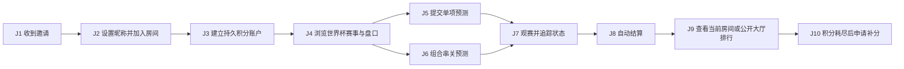

# 足球免费积分预测：用户旅程蓝图

## 1. 蓝图目的

本蓝图是产品定义、UX、架构、Epic/Story 和验收测试的上游真值源。后续需求必须引用旅程节点 ID；无法映射到旅程价值或必要系统保障的功能，默认不进入首期范围。

## 2. 产品边界

- 产品是面向少量朋友的免费足球盘口数据与虚拟积分预测 PWA。
- 首期聚焦 2026 世界杯，同时采用可扩展到其他足球赛事的通用数据模型。
- 无充值、提现、转账、积分购买、积分兑换、返现、现金或实物奖励。
- 赛事、即时比分、比赛事件、封盘状态和赛果来自第三方足球数据源；默认赔率采用 API-FOOTBALL 返回的真实 bookmaker 市场共识，缺失时才使用明确标识的系统模型赔率。
- 首期使用 API-FOOTBALL Free，计费请求硬上限 95 次/日，为异常与人工诊断预留至少 5 次额度，绝不超过官方 100 次/日配额。
- 无独立管理后台，无人工开盘、修盘或人工结算。
- 支持公开大厅和邀请链接房间。
- 公开大厅在数据模型中作为系统房间存在，拥有独立积分账户和全站排行榜。
- 用户首次加入每个房间时，在该房间获得独立的 10,000 虚拟积分；余额永久随该房间内的输赢变化，不按周重置。
- 每张预测单最高投入 20,000 分，但不得超过所选房间的当前可用余额；私人房间积分耗尽后可向房主申请补分，公开大厅可由用户主动申请系统补回 10,000 分。
- 支持单项预测和 2 至 8 项串关。

## 3. 参与者

| 角色 | 目标 | 主要任务 |
|---|---|---|
| 房主 | 快速组织朋友参与世界杯预测 | 创建房间、分享邀请链接、查看房间榜、重置邀请链接、为积分耗尽的成员补分 |
| 参与者 | 用免费积分表达判断并和朋友比较战绩 | 加入房间、看盘、提交单项或串关、追踪赛果、查看排名 |
| 公开访客 | 先浏览赛事与主要盘口，再决定是否参与 | 查看公开大厅、设置昵称、进入预测流程 |
| 系统 | 在无人干预下保持一致、公平、可追溯 | 同步数据、校验赔率、封盘、冻结积分、结算、重算榜单 |
| 第三方数据源 | 提供系统事实依据 | 赛程、比赛状态、比分、盘口、赔率、赛果和更正 |

## 4. 北极星旅程

> 朋友收到邀请链接后，在 60 秒内进入房间并完成第一张有效预测单；比赛结束后无需人工操作即可看到正确积分和房间排名。

## 5. 详细旅程

### J1 — 收到并打开房间邀请

| 项目 | 定义 |
|---|---|
| 用户目标 | 不理解复杂规则也能立即进入朋友的房间 |
| 入口 | 房主分享的唯一邀请链接 |
| 前台体验 | 展示房间名称、房主昵称、当前成员数和“加入并开始预测” |
| 后台行为 | 校验邀请 token、解析房间、记录匿名访问，不自动收集个人信息 |
| 成功证据 | 有效链接打开成功率；从打开链接到加入房间的转化率 |
| 失败路径 | 链接无效或已重置时，明确提示并允许进入公开大厅 |

### J2 — 建立轻量身份并加入房间

| 项目 | 定义 |
|---|---|
| 用户目标 | 不注册手机号、不记密码即可参与 |
| 前台体验 | 首次仅填写昵称；确认后自动加入目标房间 |
| 后台行为 | 生成本地身份密钥与恢复码；浏览器保存会话；昵称在房间内唯一 |
| 成功证据 | 中位完成时间不超过 30 秒；身份创建后自动回到目标房间 |
| 失败路径 | 昵称冲突时给出可接受建议；设备更换时可用恢复码找回身份 |

### J3 — 建立并理解持久积分账户

| 项目 | 定义 |
|---|---|
| 用户目标 | 清楚知道自己能投入多少，以及每笔输赢如何改变长期余额 |
| 前台体验 | 展示当前房间的总余额、可用积分、冻结积分和累计已结算输赢；切换房间时余额随之切换 |
| 后台行为 | 用户首次进入公开大厅或加入私人房间时，创建由 `user_id + room_id` 唯一确定的积分账户并发放 10,000 分；使用不可篡改积分账本永久记录每次冻结、结算、退回、更正和房主补分 |
| 成功证据 | 用户能在不查看帮助文档的情况下理解余额和冻结积分 |
| 规则 | 不允许负余额、透支、积分转让或额外购买 |

### J4 — 浏览世界杯赛事与盘口

| 项目 | 定义 |
|---|---|
| 用户目标 | 快速找到正在进行或即将开始的世界杯比赛和所需盘口 |
| 前台体验 | 房间首屏优先展示世界杯；支持今日、滚球、未开赛、已结束筛选 |
| 盘口范围 | 胜平负、亚洲让球、大小球、比分、半全场、双方进球、角球、罚牌和球员事件，以数据源实际覆盖为准 |
| 后台行为 | 所有用户共享服务器缓存；Free 模式按当日剩余额度动态调度，赛前低频同步，滚球通常约 5 至 10 分钟同步，绝不由用户访问直接触发供应商调用 |
| 成功证据 | 用户两次操作内进入目标比赛；清晰区分开放、暂停、关闭状态 |
| 失败路径 | 数据过期、数据源不可用或当日请求预算不足时显示暂停状态，不允许用旧赔率提交 |

### J5 — 提交单项预测

| 项目 | 定义 |
|---|---|
| 用户目标 | 选择一个结果，自定义投入积分并锁定确认赔率 |
| 前台体验 | 选择盘口选项后进入预测单；输入积分；展示预计返还和最新赔率 |
| 投入规则 | 单张最高 20,000 分，且不得超过当前可用余额 |
| 后台行为 | 提交时再次校验盘口状态、赔率版本和所选房间余额；成功后在该房间账户中冻结积分并生成不可变快照 |
| 成功证据 | 不出现超额投入或接受过期赔率；预测单可立即查询 |
| 失败路径 | 赔率变化时要求确认新赔率；暂停或封盘时拒绝提交并说明原因 |

### J6 — 提交 2 至 8 项串关

| 项目 | 定义 |
|---|---|
| 用户目标 | 组合多个盘口选项并理解组合赔率与风险 |
| 前台体验 | 预测单展示每个选项、组合赔率、投入积分和预计返还 |
| 后台行为 | 对每个选项逐项校验；全部有效才原子化创建串关并冻结积分 |
| 成功证据 | 组合赔率计算一致；任一选项失效时整单不被部分提交 |
| 公开规则 | 串关中所有相关选项封盘后，其他成员才能看到具体选择 |

### J7 — 观赛并追踪预测状态

| 项目 | 定义 |
|---|---|
| 用户目标 | 在观赛过程中知道比分、盘口状态和预测单进展 |
| 前台体验 | 展示滚球比分、比赛时钟、进行中预测单和暂定状态 |
| 后台行为 | 使用轻量轮询更新状态；保持预测时赔率快照不变 |
| 成功证据 | 比赛状态与数据源最终一致；网络恢复后自动补齐更新 |
| 社交规则 | 封盘前只显示其他成员“已提交”；不公开其选项和投入积分 |

### J8 — 自动结算与更正

| 项目 | 定义 |
|---|---|
| 用户目标 | 比赛结束后无需等待房主操作即可获得可信结果 |
| 结算规则 | 赢：投入 × 确认赔率；输：冻结积分归零；走盘：倍率按 1.0；半赢/半输：拆分计算 |
| 串关规则 | 有效倍率相乘；任一项输则整单输；取消项按 1.0 移除 |
| 后台行为 | 只根据数据源最终状态结算；结算过程幂等；数据源更正后重算积分和榜单 |
| 成功证据 | 同一预测单重复执行不会重复入账；账本可以解释每次积分变化 |
| 失败路径 | 推迟赛事保持待结算；确认取消后退回积分；无法判定时继续等待而不猜测结果 |

### J9 — 查看公开与房间排名

| 项目 | 定义 |
|---|---|
| 用户目标 | 和朋友比较累计表现并复盘已公开预测 |
| 前台体验 | 私人房间展示该房间余额、累计预测净收益、收益率、命中率、累计补分和房间排名；公开大厅展示独立余额与全站排行榜 |
| 后台行为 | 结算、更正或补分后增量重算对应房间排行榜；公开大厅作为系统房间独立计算全站排行；`OWNER_GRANT` 只增加对应私人房间的可用余额，不计入预测收益 |
| 成功证据 | 排名与积分账本一致；能从榜单进入已公开的预测记录 |
| 隐私 | 未封盘预测不得通过榜单、接口或页面元数据泄露 |

### J10 — 积分耗尽与补分

| 项目 | 定义 |
|---|---|
| 用户目标 | 积分输完后仍能继续参与，同时不把补分伪装成预测收益 |
| 私人房间体验 | 余额不足时向房主发起补分申请；房主在同一 PWA 的申请列表中填写数量并批准或拒绝 |
| 公开大厅体验 | 余额不足时由用户主动申请系统补回 10,000 分，并明确确认本次补分将增加公开展示的补分次数 |
| 后台行为 | 私人房间批准后写入 `OWNER_GRANT`；公开大厅确认后写入 `SYSTEM_GRANT`；两者均保存房间、接收人、数量、原因和幂等键，且不计入预测净收益 |
| 成功证据 | 非房主无法批准私人补分；公开大厅不会静默自动补分；重复操作不会重复入账；排行榜可区分预测收益和补分 |

## 6. 服务蓝图

| 层次 | 核心职责 |
|---|---|
| 用户行为 | 加入房间、看盘、选择、输入积分、提交、观赛、看榜 |
| 前台触点 | 房间首页、赛事列表、比赛详情、预测单、我的预测、排行榜、恢复身份 |
| 应用服务 | 身份、房间、赛事查询、盘口查询、预测校验、串关计算、排行榜 |
| 后台任务 | 赛事同步、滚球同步、状态检测、封盘、结算、更正重算、持久积分账本、房主补分与公开大厅系统补分 |
| 数据基础 | 第三方赛事/赔率 API、关系数据库、按 `user_id + room_id` 隔离的积分账户与账本、赔率快照、同步游标 |
| 保障机制 | 幂等键、数据新鲜度阈值、事务冻结、审计日志、接口限流、健康检查 |

## 7. 关键失败场景

| ID | 场景 | 默认处理 |
|---|---|---|
| F1 | 数据源超时或额度耗尽 | 标记数据过期并暂停提交，不使用旧赔率兜底 |
| F2 | 提交瞬间赔率变化 | 返回最新赔率，用户重新确认后再提交 |
| F3 | 盘口暂停或关闭 | 拒绝新预测，已提交预测保持原快照 |
| F4 | 重复点击提交 | 使用幂等键只创建一张预测单、只冻结一次积分 |
| F5 | 比赛推迟或取消 | 推迟保持待定；取消后退回积分；串关该项按 1.0 |
| F6 | 数据源更正赛果 | 逆向原结算并按新结果重算，榜单同步更新 |
| F7 | 浏览器数据被清除 | 使用恢复码恢复身份；无法恢复时创建新身份，不合并积分 |
| F8 | 邀请链接被房主重置 | 旧链接失效；已加入成员不被移出房间 |
| F9 | 房主重复点击补分 | 使用幂等键只执行一次补分，并保留完整账本记录 |
| F10 | 成员重复提交补分申请 | 同一成员只保留一个待处理申请，房主处理后才允许再次申请 |
| F11 | 公开大厅重复申请系统补分 | 使用幂等键只补回一次，并累加可公开查看的系统补分次数 |

## 8. 免费 API 每日请求预算

API-FOOTBALL Free 官方上限为每日 100 次计费请求。系统以 95 次作为内部硬上限，并按以下预算调度：

| 用途 | 每日预算 | 说明 |
|---|---:|---|
| 赛程与静态信息 | 5 | 按世界杯赛事批量获取并长期缓存 |
| 赛前赔率快照 | 10 | 只在存在待开赛比赛时使用 |
| 滚球比分与赔率 | 70 | 每个轮询周期最多两次批量调用；根据活跃比赛窗口动态计算间隔 |
| 最终赛果、结算与失败重试 | 10 | 受保护预算，不得被普通轮询占用 |
| 内部总上限 | **95** | 至少保留 5 次官方额度缓冲 |

调度约束：

- 每次调用后读取 `x-ratelimit-requests-remaining`，本地计数与供应商剩余额度取更小值。
- 使用不计入日配额的 `/status` 端点校准 `current` 与 `limit_day`。
- 配额按官方规则在每日 00:00 UTC 重置。
- 滚球轮询间隔按 `预计剩余活跃秒数 × 每轮调用数 ÷ 剩余滚球预算` 动态计算。
- 当剩余预算接近受保护的 10 次结算额度时，立即停止赔率轮询，只保留最终赛果与结算。
- 所有用户读取数据库缓存，页面刷新、切换房间或重复打开比赛不得增加供应商调用次数。

## 9. 首期体验指标

| 指标 | 目标 |
|---|---|
| 邀请链接到加入房间中位时间 | ≤ 30 秒 |
| 加入房间到首张预测提交中位时间 | ≤ 60 秒 |
| 预测提交重复冻结积分 | 0 |
| 已结算预测无法解释的积分差异 | 0 |
| 过期或暂停盘口被接受 | 0 |
| 比赛最终状态确认后的自动结算成功率 | 100%，允许重试后达成 |
| API-FOOTBALL 每日计费请求 | ≤ 95，官方配额绝不超过 100 |

## 10. 需求追踪约定

- PRD 功能需求格式：`FR-J{旅程号}-{序号}`。
- UX 流程格式：`FLOW-J{旅程号}`。
- Story 验收标准必须引用至少一个 `J` 或 `F` 编号。
- E2E 用例格式：`E2E-J{旅程号}-{序号}`。
- 架构决策若只解决技术偏好、无法支撑旅程或失败场景，默认不采用。

## 11. 暂不纳入首期

- 充值、提现、真钱、奖品、积分交易或兑换。
- 手机号、短信验证码、社交账号登录。
- 独立管理后台和人工修盘。
- Android/iOS 原生应用。
- 聊天、私信、评论和复杂社区治理。
- 多租户白标 SaaS、广告和会员收费。

## 12. 已确认决策

| 决策 | 结果 |
|---|---|
| 产品形态 | 公开大厅 + 私域房间的免费足球积分预测 PWA |
| 首期赛事 | 2026 世界杯优先 |
| 身份 | 昵称 + 本地身份 + 恢复码，无手机号和密码 |
| 房间入口 | 邀请链接直接进入对应房间 |
| 加入权限 | 获得有效链接即可加入；房主可重置链接 |
| 预测公开 | 封盘后公开；封盘前只显示“已提交” |
| 首次初始积分 | 10,000，一次性发放，余额永久累计且不按周重置 |
| 单张上限 | 20,000，且不得超过当前可用余额 |
| 积分耗尽 | 私人房间向房主申请补分；公开大厅由用户主动申请系统补回 10,000 分 |
| 补分流程 | 成员先发起申请，房主填写补分数量并批准或拒绝 |
| 排行榜补分口径 | `OWNER_GRANT` 与 `SYSTEM_GRANT` 增加可用余额但不计入预测收益；排行榜单独展示累计补分及公开大厅系统补分次数 |
| 多房间积分 | 每个房间拥有独立积分账户；输赢、冻结、补分和排行榜互不影响 |
| 公开大厅 | 作为系统房间运行；首次参与发放独立 10,000 分；全站排行榜只统计公开大厅预测；余额不足时用户可主动申请系统补回 10,000 分 |
| 预测类型 | 单项 + 2 至 8 项串关 |
| 系统控制 | 全自动数据、封盘和结算，无独立后台 |
| 赔率数据策略 | API-FOOTBALL 市场赔率优先；系统模型只作明确标识的缺失回退，不静默混用 |
| 免费请求预算 | API-FOOTBALL 每日内部硬上限 95 次，保留至少 5 次官方额度缓冲 |
| 交付节奏 | 双轨：世界杯剩余窗口验证数据与核心交互，正式版延续到后续俱乐部赛事 |
| 世界杯验证轨边界 | 一个私人房间、单一 bookmaker、赛前胜平负、单项预测、自动结算与房间榜；滚球只展示 |
